## Problem 1

实验结果如下所示。

<figure>
  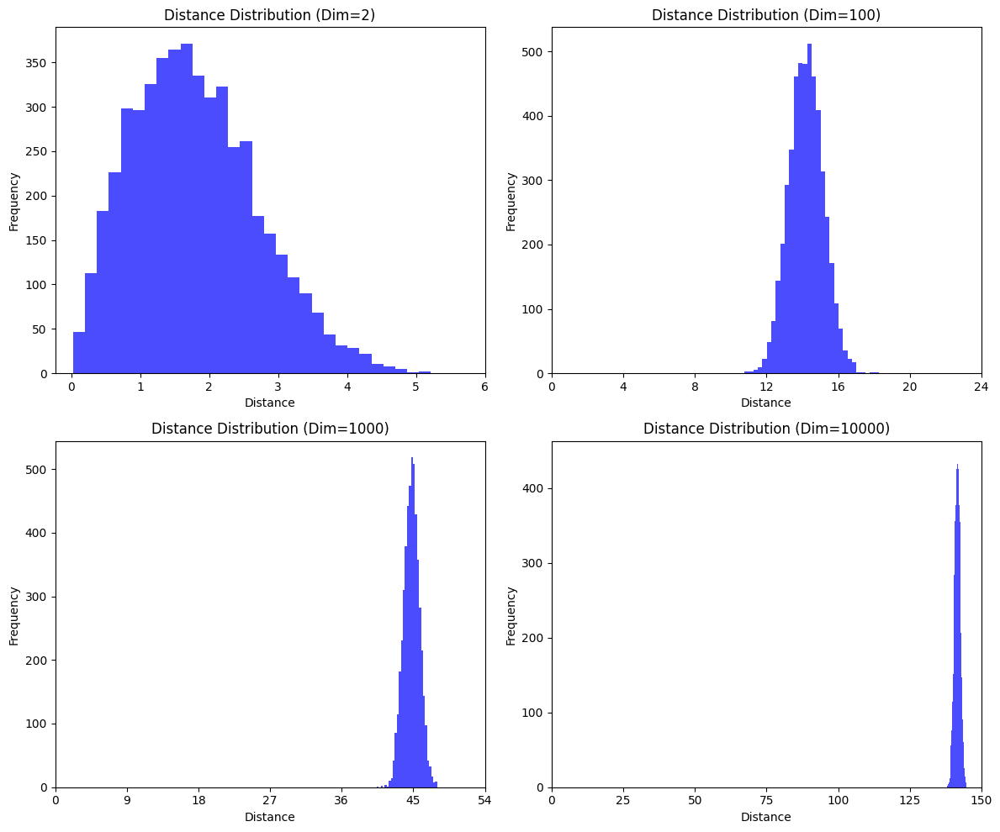
  
<figcaption>图1 不同维度下距离的分布（X轴均匀分布）</figcaption>

</figure>

<figure>
  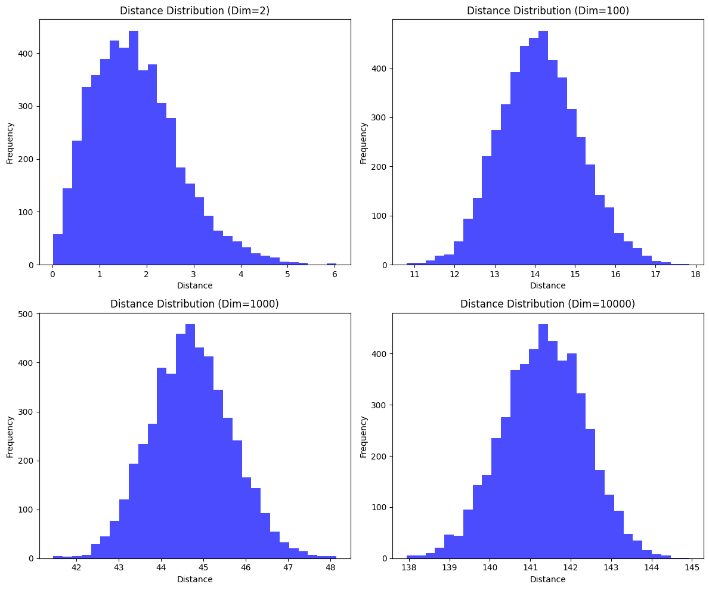
  
<figcaption>图2 不同维度下距离的分布（去除空白部分）</figcaption>

</figure>

可以看到不同维度下距离整体的分布的形态是类似的，都形如正态分布，但是越高维度均值就越大，对应高维的点更加稀疏。这是由于维度越高，单位球的体积愈加集中在靠近外侧，从而从同样分布采样出的点更加互相远离。

## Problem 2

### (1)

#### PCA

下图是1号受试者在PCA降维之后的特征可视化。左图是原数据直接做PCA降维之后的结果，右图则是先经过了标准化。可以看到，由于这是无监督学习，所以降维的效果较差，虽然积极与其他类的分类的较为清晰，但是中性的类别掺杂在消极中，不利于线性分类器的建立。一般来说先进行标准化的数据表现的会更好，这里对比发现存在差异但是并没有优劣之分，可能是因为维度太少的原因，且PCA是无监督学习，没有利用上我们的类别信息。

<figure display=flex>
  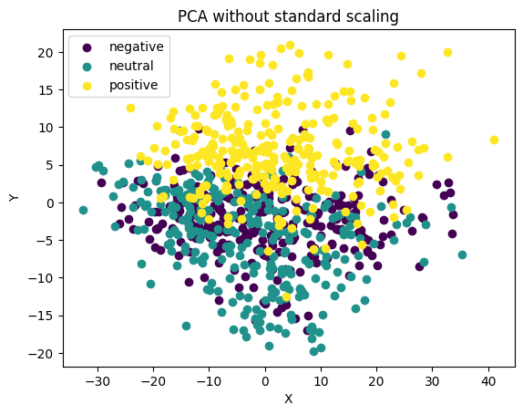 
  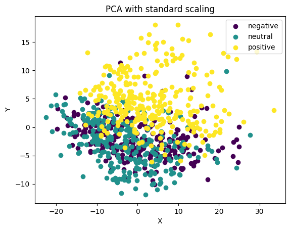
  
<figcaption>图3 1号受试者在PCA降维之后的特征</figcaption>

</figure>

#### LDA

下图是1号受试者在LDA降维之后的特征可视化。左图是原数据直接做LDA降维之后的结果，右图则是先经过了标准化。可以发现两者的结果完全一致，更进一步地，我们证明对数据做任何可逆仿射变换之后LDA都不变。

假设原本的样本为$x$，令$x' = Ax + b$，$Ax+b$代表一个可逆的仿射变换，这意味着$A$可逆。假设原本的$J(w) = \frac{w^TS_Bw}{w^TS_Ww}$的解为$w$，那么新的方向向量$w'=A^{-T}w$。

$S'_w = \sum_i \sum_{x \in C_i} (x'-\mu'_i)(x'-\mu'_i)^T = \sum_i A(x-\mu_i)(x-\mu_i)A^T$

$S'_B = \sum_i |C_i|(\mu'_i-\mu)(\mu'_i-\mu)^T=AS_BA^T$

由于$A$可逆，这意味着新的方向向量的解即为$w'=A^{-T}w$，$x'$在该方向上的投影为$w'^Tx'=wA^{-T}(Ax+b)$。

由于偏移量$b$保证了均值为$0$，所以两次LDA得到的图像完全一致。

<figure display=flex>
  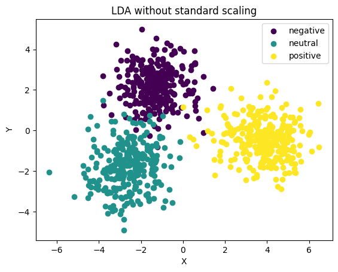 
  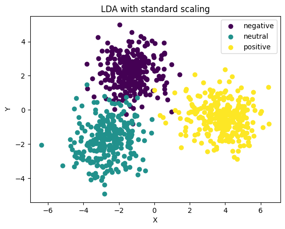
  
<figcaption>图4 1号受试者在LDA降维之后的特征</figcaption>

</figure>

#### TSNE

下图是1号受试者在TSNE降维之后的特征可视化。下面选取了$perplexity=1,5,10,30,50$时的表现：

<figure display=flex>
  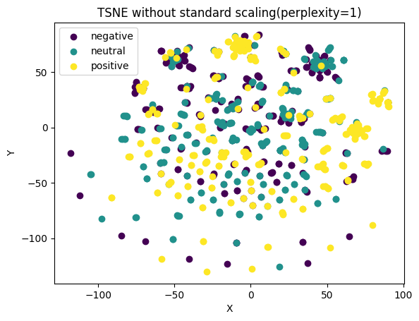 
  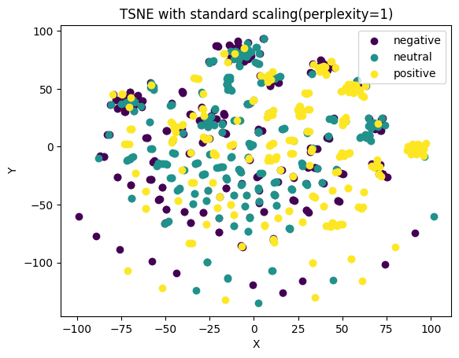
  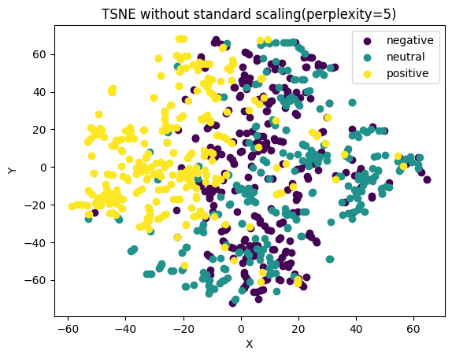 
  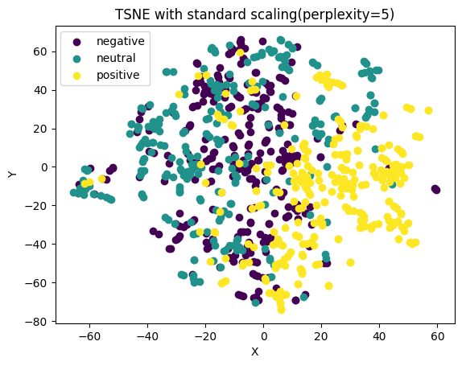
  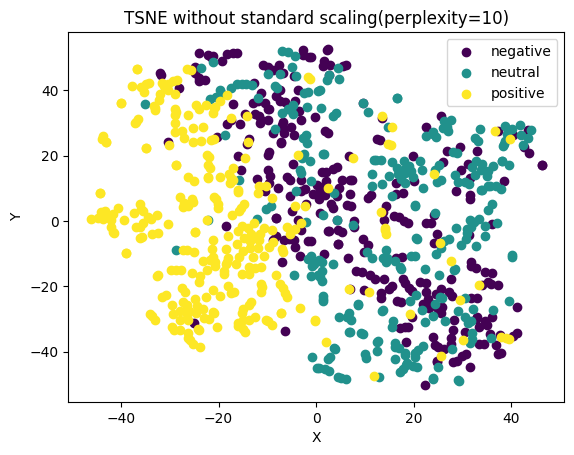 
  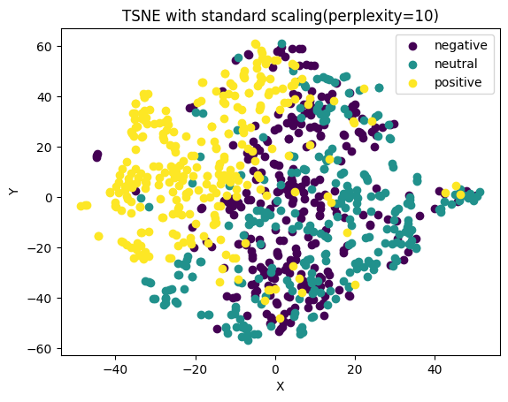
  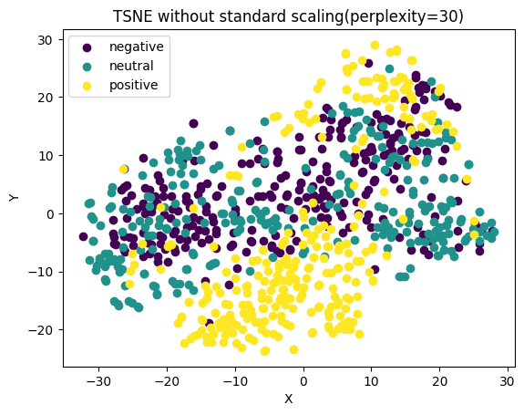 
  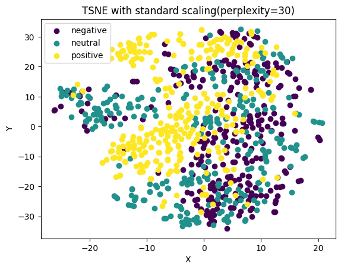
  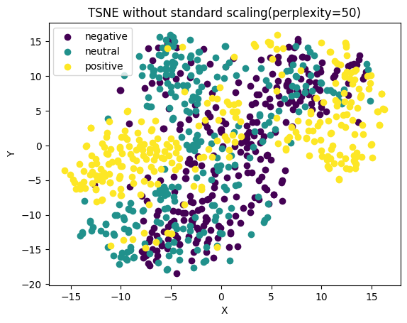 
  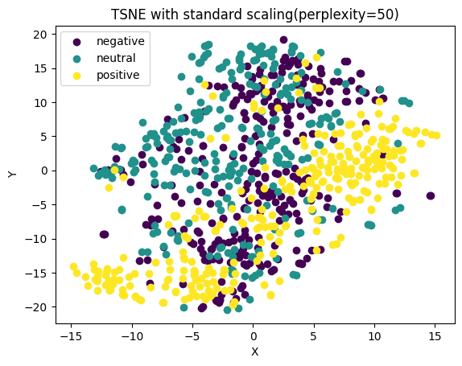
  
<figcaption>图5 1号受试者在TSNE降维之后的特征</figcaption>

</figure>

可以发现，perplexity过小(1)或者过大(30，50)时表现都不佳。TSNE是一个无监督学习，因此效果远不如LDA，其中perplexity=5，10时效果和PCA比较接近，但还是略差于PCA。可以发现标准化之后的结果相比标准化前的更加紧密一些。在这个问题中，我们只有三类标签，而较低的perplexity（如5-10）会使t-SNE更关注数据的局部结构，适合小规模数据集或簇较密集的情况；较高的perplexity（如50-100）则更适合捕捉全局结构，适用于大规模数据集或簇较稀疏的情况。

### (2)

#### PCA

可以看到PCA降维是比较失败的，整体被大约分成了两团，团内不同类别的数据点糅杂在一起。标准化之后的结果相比未标准化的结果更加圆一些。

<figure display=flex>
  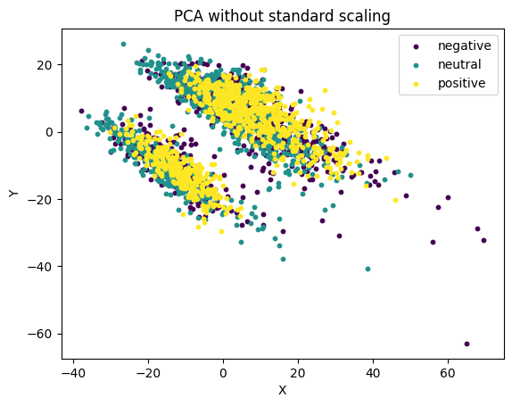 
  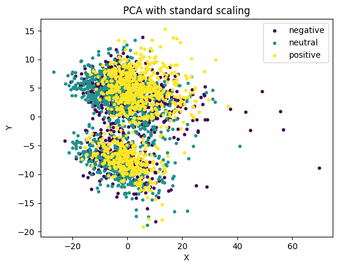
  
<figcaption>图6 全部受试者在PCA降维之后的特征</figcaption>

</figure>

#### LDA

可以看到LDA由于是有监督学习，整体还是分的比较开的，但是中性和消极仍有部分的重叠。

<figure display=flex>
  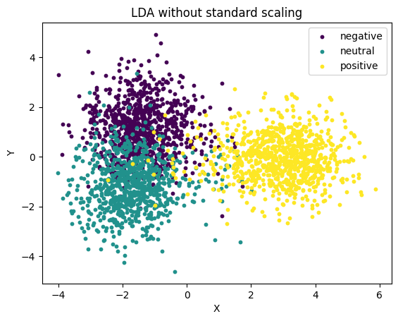 
  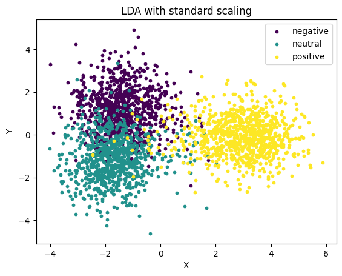
  
<figcaption>图7 全部受试者在LDA降维之后的特征</figcaption>

</figure>

#### TSNE

可以看出来TSNE在鉴别三类情绪的方面还是做的不是很好，仅能比较清晰的分类出积极的情绪，但是意外的是TSNE在鉴别三个受试人方面做的非常好，无论是perplexity=5,10,30都分类的非常好。三种降维方式中还是perplexity=5是最好的，整体情绪偏消极的在中间集中，偏积极的在外部。

<figure display=flex>
  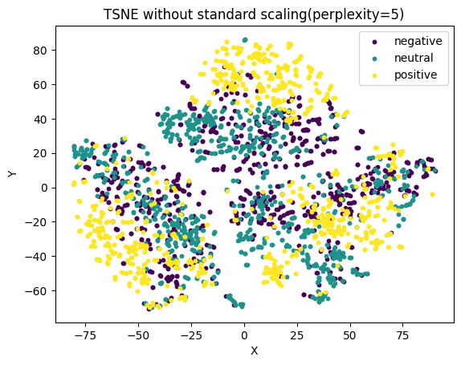 
  
  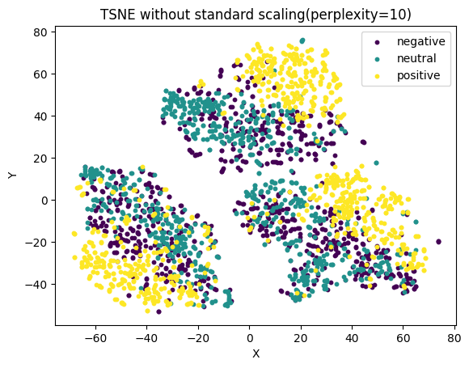 
  
  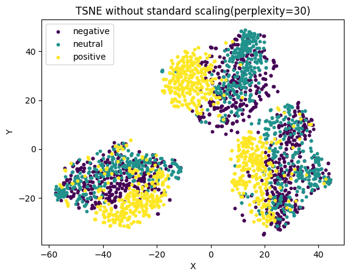 
  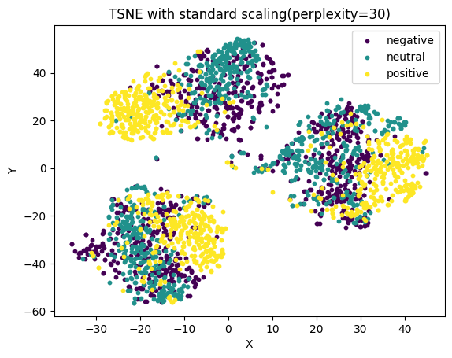
  
<figcaption>图8 全部受试者在TSNE降维之后的特征</figcaption>

</figure>

<figure display=flex>
  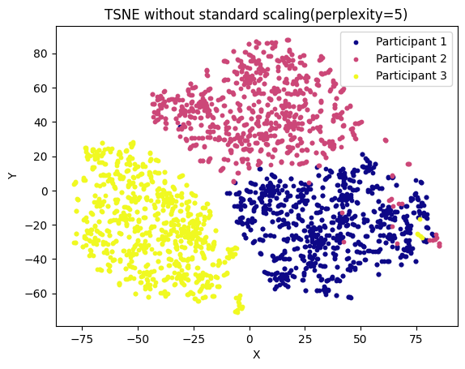 
  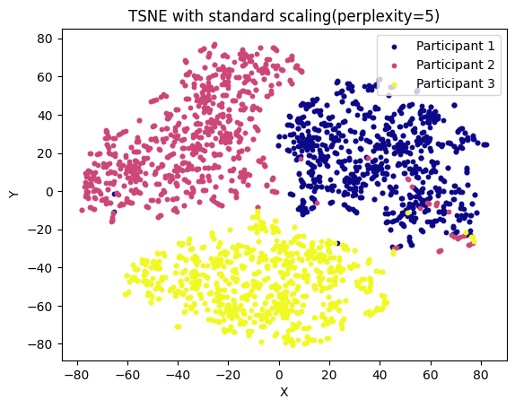
  
<figcaption>图9 全部受试者在TSNE降维之后的特征（按受试者分类）</figcaption>

</figure>

### (3)

#### SVM

由于没有划分CV集，不妨把第一个受试者的测试集当成CV集来调整超参数。sklearn中的SVM库常调整的超参数是kernel的类型和惩罚项系数C的大小。惩罚项系数越大，对分类错误的惩罚越大，但是更加容易过拟合。下表给出了在不同参数下，SVM在训练集和测试集上的acc变化。

  <table align=center>
    <thead>
      <tr>
        <th>Kernel</th>
        <th>linear</th>
        <th>poly</th>
        <th>rbf</th>
        <th>sigmoid</th>
      </tr>
    </thead>
    <tbody>
      <tr><td><b>C = 0.010</b></td><td>0.973</td><td>0.968</td><td>0.414</td><td>0.414</td></tr>
      <tr><td><b>C = 0.100</b></td><td>1.000</td><td>1.000</td><td>0.645</td><td>0.414</td></tr>
      <tr><td><b>C = 1.000</b></td><td>1.000</td><td>1.000</td><td>0.882</td><td>0.414</td></tr>
      <tr><td><b>C = 2.000</b></td><td>1.000</td><td>1.000</td><td>0.918</td><td>0.414</td></tr>
      <tr><td><b>C = 5.000</b></td><td>1.000</td><td>1.000</td><td>0.950</td><td>0.414</td></tr>
      <tr><td><b>C = 10.000</b></td><td>1.000</td><td>1.000</td><td>0.968</td><td>0.414</td></tr>
      <tr><td><b>C = 20.000</b></td><td>1.000</td><td>1.000</td><td>0.995</td><td>0.414</td></tr>
    </tbody>
  </table>

  
<figcaption>表格1 不同C和kernel选择下训练集上ACC的变化</figcaption>

<table>
  <thead align="center">
    <tr>
      <th>Kernel</th>
      <th>linear</th>
      <th>poly</th>
      <th>rbf</th>
      <th>sigmoid</th>
    </tr>
  </thead>
  <tbody align="center">
    <tr><td><b>C = 0.010</b></td><td>0.655</td><td>0.662</td><td>0.208</td><td>0.208</td></tr>
    <tr><td><b>C = 0.100</b></td><td>0.651</td><td>0.651</td><td>0.444</td><td>0.208</td></tr>
    <tr><td><b>C = 1.000</b></td><td>0.651</td><td>0.651</td><td>0.673</td><td>0.208</td></tr>
    <tr><td><b>C = 2.000</b></td><td>0.651</td><td>0.651</td><td>0.669</td><td>0.208</td></tr>
    <tr><td><b>C = 5.000</b></td><td>0.651</td><td>0.651</td><td>0.669</td><td>0.208</td></tr>
    <tr><td><b>C = 10.000</b></td><td>0.651</td><td>0.651</td><td>0.662</td><td>0.208</td></tr>
    <tr><td><b>C = 20.000</b></td><td>0.651</td><td>0.651</td><td>0.651</td><td>0.208</td></tr>
  </tbody>
</table>

<figcaption>表格2 不同C和kernel选择下测试集上ACC的变化</figcaption>

可以发现，sigmoid核完全不适合这个任务，最适合这个任务的是rbf核。惩罚项C过大时会出现过拟合现象，过小的时候会欠拟合，最终我们选择的超参数是rbf与C=1。使用这个超参数对三个受试者分别做SVM，得到下表的结果：

<table>
  <thead align="center">
    <tr>
      <th>Paticipant</th>
      <th>1</th>
      <th>2</th>
      <th>3</th>
    </tr>
  </thead>
  <tbody align="center">
    <tr><td><b>Train acc</b></td><td>0.882</td><td>0.889</td><td>0.903</td></tr>
    <tr><td><b>Test acc</b></td><td>0.673</td><td>0.711</td><td>0.637</td></tr>
  </tbody>
</table>

<figcaption>表格3 SVM模型在三个受试者训练集和测试集上的准确率</figcaption>

#### KNN

同样的，我们先用第一位受试者作为我们选择超参数的依据。

<figure display=flex>
   
  
<figcaption>图10 第一位受试者在不同k下训练集和测试集的表现</figcaption>

</figure>

我们可以看到选择较大的$k$并没有使得结果显著变好，同时训练准确率也在稳步下降。最终我们选择$k=5$。

<table>
  <thead align="center">
    <tr>
      <th>Paticipant</th>
      <th>1</th>
      <th>2</th>
      <th>3</th>
    </tr>
  </thead>
  <tbody align="center">
    <tr><td><b>Train acc</b></td><td>0.891</td><td>0.912</td><td>0.875</td></tr>
    <tr><td><b>Test acc</b></td><td>0.581</td><td>0.634</td><td>0.504</td></tr>
  </tbody>
</table>

<figcaption>表格4 SVM模型在三个受试者训练集和测试集上的准确率</figcaption>

